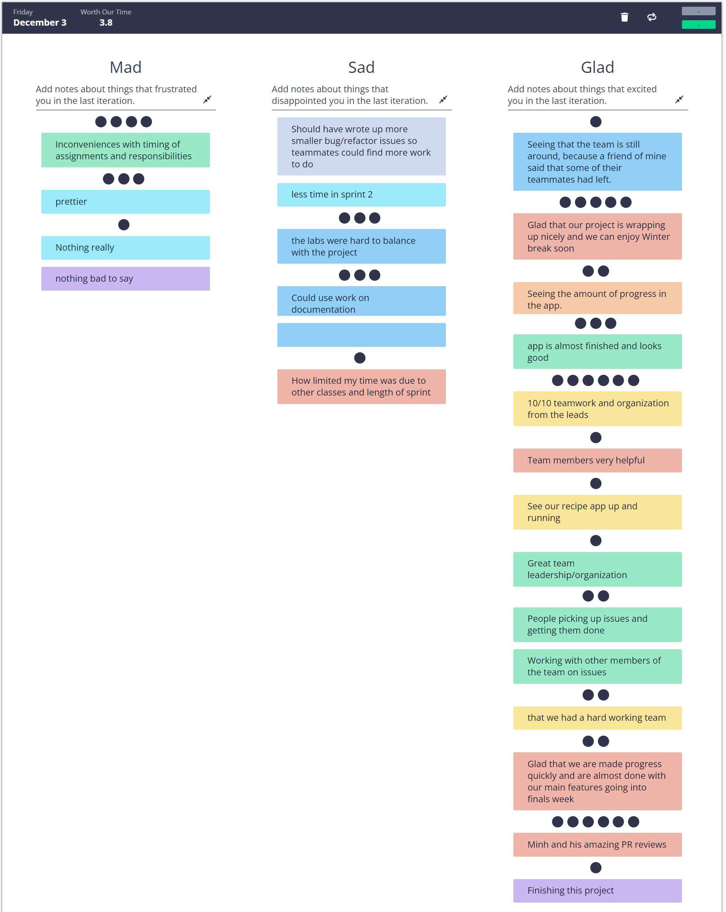

### Team 24 | 11-19-2021 | Zoom | 13:30 - 14:00

## Sprint 2 Retrospective

### Attendance:

- [x] Adan Estrada
- [x] Alessandro Todaro
- [x] Andrew Lee
- [x] Ansav Panda
- [x] Edgar Diaz
- [x] Gabriel Leong
- [x] Grant Duntugan
- [ ] Hema Thota
- [x] Keli Wang
- [x] Minh Dinh
- [x] Quyen Nguyen

### Unresolved Issues

N/A

### Agenda

- Retrospective is an opportunity for all team members to voice their opinions about how the sprint went
- This time we will try using Retrium to do retro with Mad/Sad/Glad

### Unfinished Issues

N/A

### Meeting Notes

# What went well

- Top Voted
  - Minh and his amazing PR reviews
  - Organization and leads
  - Project progress over the course of the class
  - App almost finished and looks good
  - People picking up issues and getting them done

# What didnt't go well

- Top Voted
  - Inconveniences with timing of assignments and responsibilities
  - Prettier
    - Setting up the linter
    - Remembering to format
    - VScode's way of handling linters
  - Labs were hard to balance with the project
    - Self-learning took the most time of the lab
    - Videos for the labs were helpful though
  - Could use work on documentation
    - Need more descriptive comments
    - Need to fix formatting on some docs

# What should we change or improve

- No comments, last sprint

