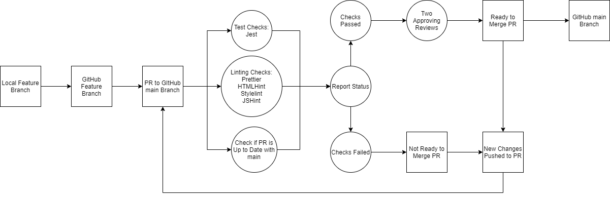

The pipeline starts at the local feature branch. Changes from the local feature branch will be pushed to the corresponding remote feature branch on GitHub. Once a pull request into `main` is opened for that feature branch, GitHub actions will run several checks on the pull request. 

One workflow will run four linters: Prettier, HTMLHint, Stylelint, and JSHint. Prettier will check if the changes are formatted correctly. HTMLHint, Stylelint, and JSHint will also check for proper formatting and run validations as well as detect changes that could possibly introduce errors for HTML, CSS, and JavaScript files, respectively. All linters need to pass with no errors for this check to succeed. Another workflow will run all Jest tests in the repository and all Jest tests need to pass for this check to succeed. GitHub will also check to make sure that the pull request is up to date with `main`. These three checks need to all pass.

Two approving reviews also need to be made on the pull request by two other team members. Once the pull request has two approvals and passes all three checks, then the pull request is ready to merge into `main`.

If any of the checks fail or the pull request does not have two approving reviews, then the pull request will not be allowed to be merged into `main`.

If at any time new changes are pushed to the pull request, GitHub Actions will re-run all the linting, testing, and up to date with `main` checks.

We currently have JSDoc configured in our repo, but we do not have a pipeline to automate creating and adding the docs to `main` yet. Currently, we can run JSDoc locally to generate docs, then push the docs and the changes to a pull request.