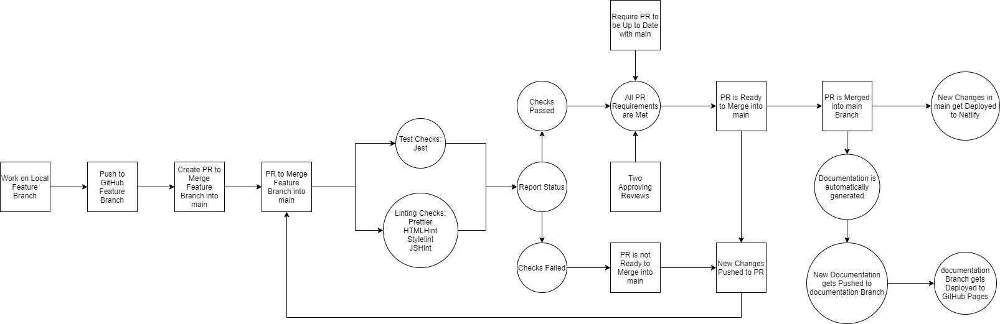

The pipeline starts at the local feature branch. Changes from the local feature branch will be pushed to the corresponding remote feature branch on GitHub. Once a pull request into `main` is opened for that feature branch, several requirements will have to be met in order for a pull request to be eligible to be merged into `main`. 

One workflow will run four linters: Prettier, HTMLHint, Stylelint, and JSHint. Prettier will check if the changes are formatted correctly. HTMLHint, Stylelint, and JSHint will also check for proper formatting and run validations as well as detect changes that could possibly introduce errors for HTML, CSS, and JavaScript files, respectively. All linters need to pass with no errors for this check to succeed. Another workflow will run all Jest tests in the `source` directory and all Jest tests need to pass for this check to succeed. Both of these checks need to succeed for the open pull request.

Two approving reviews also need to be made on the pull request by two other team members. Lastly, GitHub will check to make sure that the pull request is up to date with `main`. In other words, the latest changes from `main` have to be merged into the pull request and any merge conflicts with `main` must be resolved for this check to pass. Once the pull request has two approvals, passes the workflow checks, and is up to date with `main`, then the pull request is ready to merge into `main`.

If any of the checks fail, the pull request does not have two approving reviews, or the pull request is not up to date with `main`, then the pull request will not be allowed to be merged into `main`.

If at any time new changes are pushed to the pull request, GitHub Actions will re-run all the linting and testing workflows. These workflows will have to succeed again in order to meet the requirements for merging.

Once the pull request is merged into `main`, two deployments are triggered simultaneously. 

The first deployment starts off with a GitHub Actions workflow that begins to automatically generate documentation using JSDoc. The new documentation lives in the `docs` directory. The generated documentation then gets merged into the `documentation` branch, and from there, the new changes in the `documentation` branch get deployed to GitHub Pages.

The second deployment handles the deployment of the web application to Netlify. When new changes are detected in the `main` branch, Netlify will automatically trigger a deployment process that builds and hosts the Impasta Rosta web application on a custom Netlify URL.
