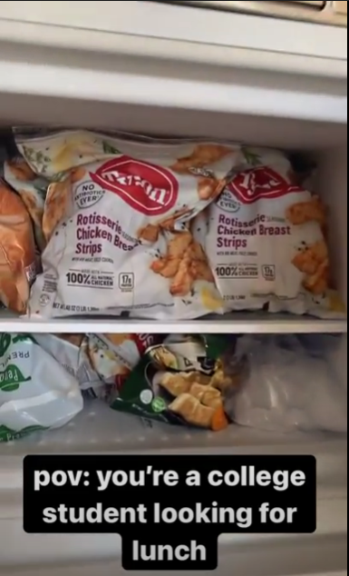
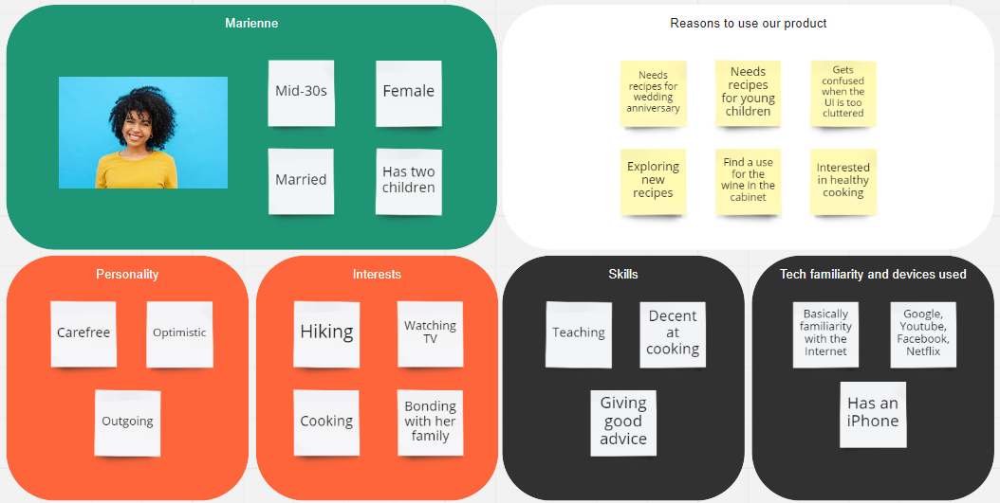
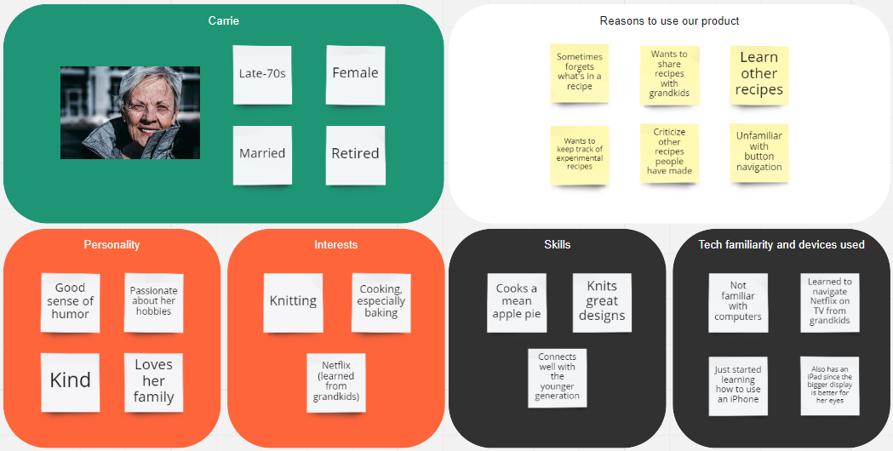
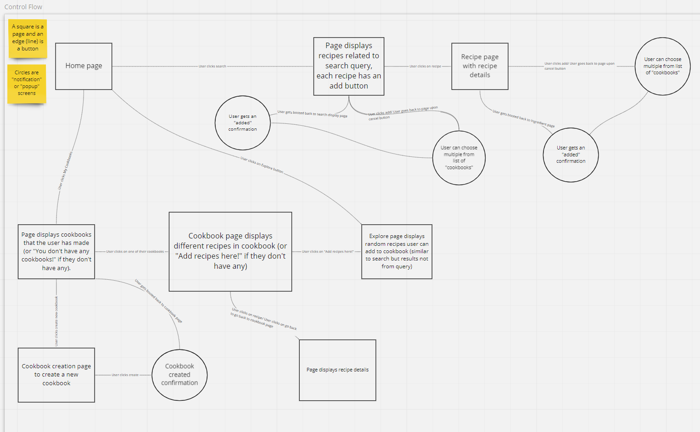

# Impasta Rosta Pitch

## The Problem

Food. We all eat it. And yet, not all of us know how to make it. According to the US Department of Agriculture, millennials like us consume food from a restaurant 30% more than any other generation. It makes sense: less dishes, less work, more time to do other things. But when our most convenient option for food as college students is most likely McDonalds, or any other fast food restaurant, it becomes clear that eating out is not the most sustainable option. However, learning to cook isn’t the easiest thing to do either. It requires tools and experience. A lot of it. And so, we have Impasta Rosta.

## Appetite

Before I started living near campus, my parents gave me a recipe for steamed egg. They texted me a link to a cooking site, and I ended up in the kitchen, cracking three eggs, pouring three cups of water, and beating and steaming the mixture. However, what I got looked nothing like what was in the picture. I've tried to make that egg seven times over the past two months. Only one of them was a success, and I have no recollection of what I did to make that happen. It was safe to say, however, that there was no way that I was going to keep notes of my process in my notebook. Now, my refrigerator looks like this:

So, what if we made a recipe app that allowed an adaptive cooking process for beginners? One in which users could search recipes, save them, and have the ability to explore cooking in their own way? One of the core issues with beginners is that they lack organization in their cooking. Considering we only have five weeks to design a solution for beginner cooks, our app will focus on helping beginners not only find new recipes, but also organize those recipes in a logical manner. This is the idea behind our app, Impasta Rosta.

## Out Target Audience

From our original problem statement, it would seem obvious to gear our application towards young adults with little to no cooking experience. However, we decided to generalize our audience to all beginner cooks, which could range from people with zero cooking knowledge to amateur cooks. Since many members of our team are beginner cooks as well, it will be easier for us to understand the perspective of our users, and we can draw from our own cooking experiences when designing the application. Aside from young adult cooks, we are also considering middle aged cooks

and elderly cooks.

By taking into account beginner cooks from various age groups, we are also looking to design the application in such a way that it accommodates both differing levels of technology experience and the different types of devices used. That way, our application will feel beginner friendly, and easy to use as well as being geared towards beginners.

## Solution

Here is our solution:

The main focus of our web app is for beginners to be able to easily locate recipes, save them to a virtual cookbook, and get cooking. Users will start at the home page. From there, users can create a cookbook, complete with a name and description. They will also be able to search for recipes from there, adding any appealing recipes to their cookbook. Users will also be able to create and edit any recipes to their liking, in order to personalize their cooking process. In each recipe, users will be able to see the name of the recipe, image of the finished product, a description, serving size, cooking time, ingredients list, and instructions for the dish. If they get tired of the dish, added it on accident, or for any reason need to remove the dish from their cookbook, they can delete the dish as well. These are the main features of our core product.

## Rabbit Holes

One aspect of our app that we were strongly considering was the accessibility features when following or reading from a recipe. Although we wanted to address as many inhibiting factors as possible when using our app, we decided to keep the scope of our app within standard tap and click features. Many features could accomodate different disabilities and use cases, and we came up with several ideas, including text-to-speech and hands-off recipe viewing. However, trying to incorporate all these accessibility features would require a great amount of time that we just did not have given that we only have five weeks. 

We also wanted to have greater customizability when modifying recipes, which included adjusting the measurement units and inputting nutritional info, but there were many hidden implications that came along with greater customization. Also, since we focused our scope down to beginner cooks, we realized that having all these customizable fields was not necessary for our target users.

## Risks

To actually store and save recipes in cookbooks, we need to be able to save the user's data somewhere. Currently, we are leaning towards using a database to store recipe information, but learning how to use a database tool will likely increase our production time for our app. While some of us have limited experience with databases, we will still need to spend extra time learning database tools.

Our app will also be influenced by which APIs we decide to use to fetch data. We are currently looking into the Spoonacular to actually fetch recipes, but we still need to decide on an API to parse recipe data.
